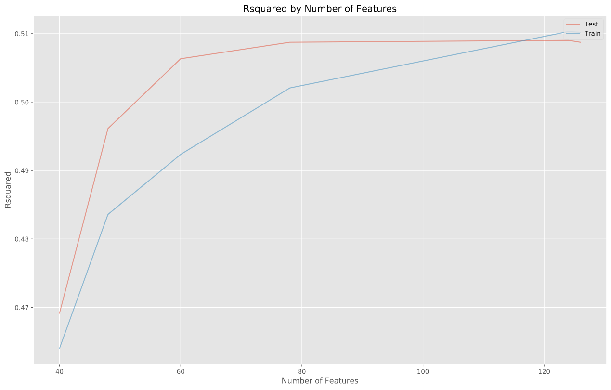
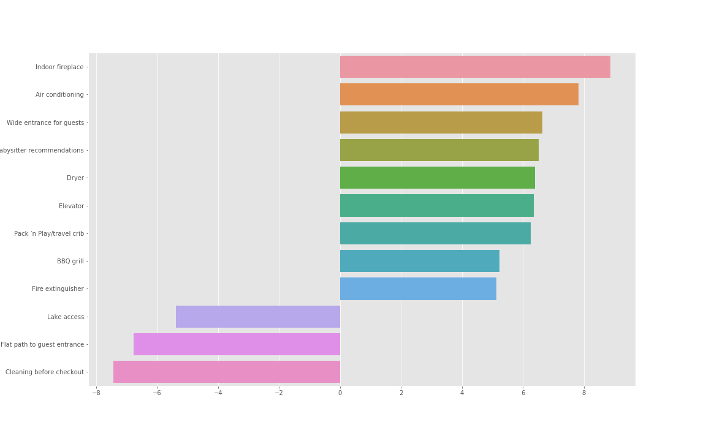

# How to make your apartments more interesting?

## Introduction
AirBNB is a community based platform in which users can offer their private accommodations to other people. So the platform acts as a kind of broker. So the right price policy is an important success factor. But how to define the price that would be  interesting for a people and will have a good return margins? So let's try to investigate this topic.

In this project I used the [Cross Industry Process](https://en.wikipedia.org/wiki/Cross-industry_standard_process_for_data_mining) for Data Mining on the [Berlin AirBnB dataset](http://insideairbnb.com/get-the-data.html). I hope this project will give you some valuable insides for Berlin.

The CRISP-DM process can be broken down into several steps which help understanding the problem

    1. Business Understanding
    2. Data Understanding
    3. Prepare Data
    4. Data Modeling
    5. Evaluate the Results
    6. Deploy

## Business questions

I decided to work with Berlin data. Because I live here and I know some of the neighborhoods here. I identified such questions:

    1. Is there a relation between rating and prices? 
    2. Is there a relation between number of reviews and prices? 
    3. Which neighborhood yields the highest returns?
    4. Can be price predicted based on the features and location?

## Data understanding

Airbnb does not provide open data in the sense of giant databases or dumps that we can work with. However, Inside Airbnb utilizes public information compiled from the Airbnb web-site and analyzes publicly available information about a city’s Airbnb’s listings, and provides filters and key metrics so we can see how Airbnb is being used in the major cities around the world. The [Berlin AirBnB dataset](http://insideairbnb.com/get-the-data.html) consists from: 

    - Detailed Listings data for Berlin  
    - Detailed Calendar Data for listings in Berlin
    - Detailed Review Data for listings in Berlin
    - Neighborhood list for geo filter. Sourced from city or open source GIS files.
    - GeoJSON file of neighborhoods of the city

I used the Detailed Listings data for my study. The raw dataset has 24586 rows and 106 columns. That is quite some data, yet not all the features are relevant or contain information that can be used to answer the above questions. For this reason the scope of features was limited.

Additionally let's take a look how complete our date is:

## Data preparation

Before starting of analyze data must be prepared and cleaned in order to model the data properly. Steps done here, were the following:

    - Remapping the boolean features (host_identity_verified, instant_bookable, host_is_super-host)
    - Creating dummy values for categorical features (room_type, cancellation_policy, neighborhood_group_cleansed)
    - Fixing the price values
    - And reengineering the amenities feature, as this was a loose sort of amenities.

After spending some time on those features, I finally removed all the rows with NaN values. Additionally I decided to remove all offers with prices more than $450 per night. This price offer cover 99.78% of initial dataset.

All the cleaning reduced amount of rows from 24586 to 17720, but this drop is fine, as we have now only full rows. Besides I've removed the columns that are not relevant for our study.

## Modelling & Evaluation

Before modeling let's verify how price is correlated with ratings.   

### Is there correlation between price and ratings?

Is it important to have a high rating, does it influenced on the price proposition? Would people tolerate the low quality for low price?

The correlation coefficient is 0.029 and this indicates that it is almost no correlation between price and ratings.

In the diagram above we see this huge cloud of various data points, where the x axis reflects the actual price and the y axis the predicted price. The red line corresponds to perfectly predicted values. The farther away from the line, the worst the prediction. As we can see for low prices our model is quite accurate.

### Is there correlation between price and reviews number?

But what about reviews numbers. Is it important to have many reviews? 

The correlation coefficient is 0.10 so there is connection between prices and reviews. Interesting that the bigger numbers of reviews have the apartments with the low price. 

### Modelling

The goal of the modeling is to find out what features have an impact on the price. A Linear Regression model was chosen. The results where a R squared value of 0.51. But what does this value mean? It basically means how good can our model predict the price compared to the actual price. A visualization makes this more clear.

The following plot shows the R^2 values based on the training set and an independent test set.

So looks like that more features makes model more accurate

#### Which neighborhood yields the highest returns?

But how exactly the neighborhood influenced on price? 

So as we can see clearly that Friedrichshain-Kreuzberg, Mitte and Pankow have the most positive effect on price. 

#### What other amenities have an impact on the price?

It seems that the fireplace and conditioner have high influence on the price. But in any case this influence is rather low.

### Deployment

The research was done as part of the Udacity Data Scientist Nanodegree program. If you want to have a look into the code for this project please feel free to check it on Github.